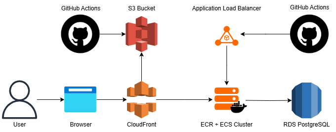

# Frontend do Sistema de Gerenciamento de Clientes

Acesse aqui: [Customer Portal](https://dmx616r1r0n7b.cloudfront.net/)

Este repositório contém o frontend do sistema de gerenciamento de clientes desenvolvido com **React** e **Vite**. A aplicação oferece uma interface responsiva e intuitiva para que os usuários possam interagir com o backend, permitindo operações como cadastro, listagem, atualização, exclusão e visualização dos clientes. A seguir, você encontrará informações sobre como configurar, executar e implantar a aplicação.

## Tecnologias Utilizadas

- **React** – Biblioteca JavaScript para construção de interfaces de usuário dinâmicas.
- **Vite** – Ferramenta de build e desenvolvimento rápida, otimizada para projetos modernos com React.
- **GitHub Actions** – Pipeline de CI/CD para deploy automático.
- **AWS S3 & CloudFront** – Hospedagem e distribuição dos arquivos estáticos da aplicação.

## Arquitetura do Sistema

A arquitetura do sistema envolve os seguintes componentes:

- **Frontend:** Implementado em React com Vite, responsável pela interface do usuário e consumo das APIs do backend.
- **Backend:** Sistema de gerenciamento de clientes que fornece os endpoints para operações CRUD.
- **Deploy:** Automatizado via GitHub Actions, com a build do frontend sendo enviada para um bucket S3 e distribuída globalmente pelo CloudFront.



## Pré-requisitos

Para executar o projeto localmente, é necessário ter instalado:

- Node.js (versão 16 ou superior)
- npm

## Configuração de Variáveis de Ambiente

Caso a aplicação necessite de configurações específicas para acessar a API do backend ou outras integrações, crie um arquivo **`.env`** na raiz do projeto com as variáveis de ambiente necessárias. Por exemplo:

- **VITE_API_URL**=https://api.seudominio.com


## Instalação

1. **Clone o repositório:**

```
git clone https://seu-repositorio.git
cd nome-do-repositorio-frontend
```
2. **Instale as dependências:**

```
npm install
```

3. **Inicie a aplicação em modo de desenvolvimento:**

```
npm run start
```

A aplicação ficará disponível no endereço configurado pelo Vite (geralmente http://localhost:3000).

## Deploy
O deploy deste projeto é automatizado através do GitHub Actions. Sempre que houver um push para a branch principal (ou outra branch configurada), o pipeline realiza as seguintes etapas:

**Build:** Compilação da aplicação utilizando Vite.
**Testes (não implementado):** Execução dos testes automatizados.
**Upload para AWS S3:** A build final é enviada para um bucket S3 que rmazena os arquivos estáticos da aplicação.
**Distribuição via CloudFront:** O conteúdo do bucket é distribuído globalmente pelo CloudFront, garantindo alta performance e disponibilidade.


## Desenvolvimento de painel administrativo
Tomando como base os 3 dias que precisei para desenvolver o projeto, podemos fazer as seguintes estimativas para o desenvolvimento do painel administrativo:

**Tempo de Desenvolvimento:**
Se formos considerar a mesma complexidade, levaríamos em torno de 3 dias para ser concluído, assumindo que a estrutura e as integrações com o backend já estejam bem definidas. Caso o painel exija mais funcionalidades ou uma interface mais elaborada, o tempo pode variar entre 3 a 5 dias.

**Quantidade de Desenvolvedores:**
Uma equipe enxuta de 1 a 2 desenvolvedores é suficiente. Por exemplo, um desenvolvedor sênior (ou tech lead) pode coordenar a arquitetura e as decisões críticas, enquanto um desenvolvedor pleno (ou até um júnior com supervisão) pode focar na implementação dos componentes da interface e na integração com a API.

**Senioridade dos Desenvolvedores:**
Idealmente, a equipe seria composta por:

- **1 Desenvolvedor Sênior:** Responsável pela definição da arquitetura, padrões de código, integração com o backend e resolução de pontos críticos.
- **1 Desenvolvedor Pleno (ou Júnior com supervisão):** Atuando na implementação da interface, consumo dos serviços e desenvolvimento de funcionalidades menos complexas.